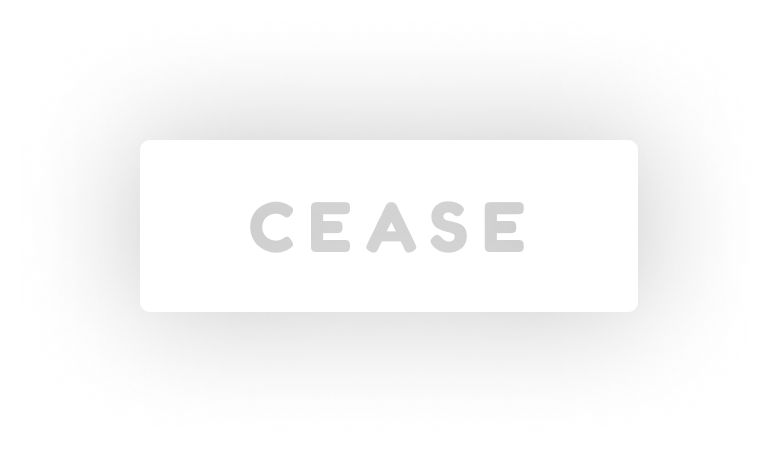

<p align="center">
  <a href="#"></a>
</p>

<h3 align="center">
  Simple, isolated CSS-in-JS for React components.
</h3>

<p align="center">
  <a href="#usage">Usage</a> ·
  <a href="#highlights">Highlights</a> ·
  <a href="#why">Why?</a> ·
  <a href="#documentation">Documentation</a>
</p>

<p align="center">
  <a href="https://bundlephobia.com/result?p=cease">
    
  </a>
  <a href="./package.json">
    
  </a>
  <a href="./LICENSE.md">
    
  </a>
</p>

<br>
<br>

## Caution

**Cease is currently experimental**. It's working well for me so far, but I haven’t used it any serious production app yet, and you should be very careful before doing so. Please give it a try, and open an [issue](https://github.com/steobrien/cease/issues) if you find anything broken or unexpected.

<br>

## Usage

```bash
npm install --save cease
```

```js
import css from "cease"

// define a React component
const Heading = ({ children }) => <h1>{children}</h1>

// apply your stylesheet to it
const Styled = css`
  h1 {
    color: red;
  }
`(Heading)

// use the styled version throughout your app
export default Styled
```

This component will now be rendered in [Shadow DOM](https://developer.mozilla.org/en-US/docs/Web/Web_Components/Using_shadow_DOM), insulating it from other styles in the app.

##### → [See more examples in the Guide…](./docs/guide.md#styling-simple-components)

<br>

## Highlights

- **tiny**: 500 bytes, zero dependencies
- **simple**: powered by native browser APIs
- **compilation-free**: no build step required
- **standard syntax**: conventional CSS without gimmicks

<br>

## Why?

CSS-in-JS is great. However, existing libraries have drawbacks:

1. **Complication**. There are many different ways to apply styles to components, leading to a large API surface area (and bugs). Additionally, compilers like Babel and Webpack are often required to run the code.
2. **Lack of isolation**. CSS scales best when components don't interfere with each other. Although many libraries promote scoping, edge cases always exist allowing styles to leak.
3. **Performance gotchas**. Common usage patterns can [impact render latency](https://calendar.perfplanet.com/2019/the-unseen-performance-costs-of-css-in-js-in-react-apps/).

Cease is an experiment to keep things simple by leveraging browser APIs for isolation in concert with standards-compliant CSS. [See more about how it works in the Guide](./docs/guide.md#how-isolation-works).

<br>

## Documentation

- **[Guide](./docs/guide.md)**
  - [Installation](./docs/guide.md#installation)
  - [Styling simple components](./docs/guide.md#styling-simple-components)
  - [How isolation works](./docs/guide.md#how-isolation-works)
  - [Styling dynamic components](./docs/guide.md#styling-dynamic-components)
  - [Performance](./docs/guide.md#performance)
  - [Processing & vendor prefixing](./docs/guide.md#processing--vendor-prefixing)
  - [Caveats](./docs/guide.md#Caveats)
- **[API Reference](./docs/api-reference.md)**
  - [`css`](./docs/api-reference.md#css)
